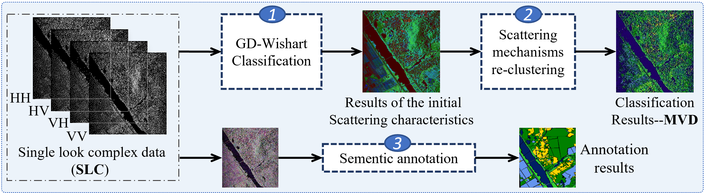
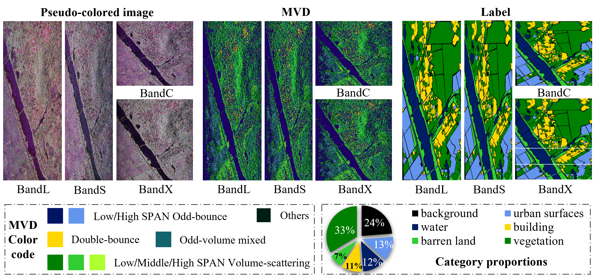
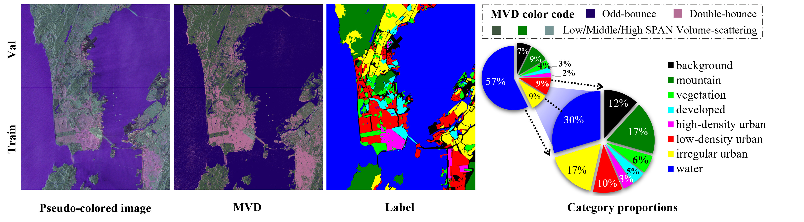
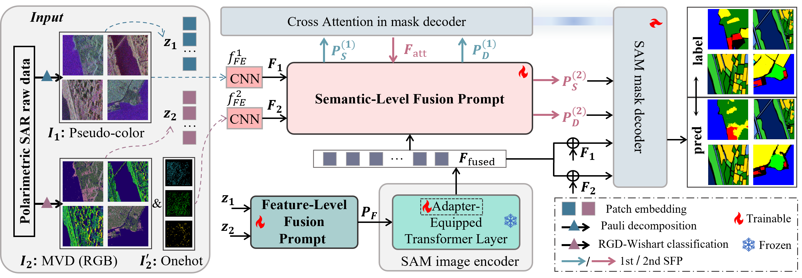

<div align="center">
<h1>PolSAM </h1>
<h3>PolSAM: Polarimetric Scattering Mechanism Informed Segment Anything Model</h3>

Paper: ([arXiv 2412.12737](http://arxiv.org/abs/2412.12737))

</div>

* [**abstract**](#abstract)
* [**datasets**](#datasets)
* [**overview**](#overview)
* [**getting started**](#getting-started)
* [**citation**](#citation)

## Abstract
------- 
PolSAR data presents unique challenges due to its rich and complex characteristics. Existing data representations, such as complex-valued data, polarimetric features, and amplitude images, are widely used. However, these formats often face issues related to usability, interpretability, and data integrity. While most feature extraction networks for PolSAR attempt to address these issues, they are typically small in size, which limits their ability to effectively extract features. To overcome these limitations, we introduce the large, powerful Segment Anything Model (SAM), which excels in feature extraction and prompt-based segmentation. However, SAM's application to PolSAR is hindered by modality differences and limited integration of domain-specific knowledge. To address these challenges, we propose the Polarimetric Scattering Mechanism-Informed SAM (PolSAM), which incorporates physical scattering characteristics and a novel prompt generation strategy to enhance segmentation performance with high data efficiency. Our approach includes a new data processing pipeline that utilizes polarimetric decomposition and semantic correlations to generate Microwave Vision Data (MVD) products, which are lightweight, physically interpretable, and information-dense. We extend the basic SAM architecture with two key contributions: The Feature-Level Fusion Prompt (FFP) module merges visual tokens from the pseudo-colored SAR image and its associated MVD, enriching them with supplementary information. When combined with a dedicated adapter, it addresses modality incompatibility in the frozen SAM encoder. Additionally, we propose the Semantic-Level Fusion Prompt (SFP) module, a progressive mechanism that leverages semantic information within MVD to generate sparse and dense prompt embeddings, refining segmentation details. Experimental evaluation on the newly constructed PhySAR-Seg datasets shows that PolSAM outperforms existing SAM-based models (without MVD) and other multimodal fusion methods (with MVD). The proposed MVD enhances segmentation results by reducing data storage and inference time, outperforming other polarimetric feature representations.

## Datasets
------- 
* Data processing pipeline: unsupervised GD-Wishart classification, MVD generation through re-clustering of scattering mechanisms, and semantic annotation, illustrated with the PhySAR-Seg-1 dataset.

<p align="center">
  
</p>

* Visualization of the PhySAR-Seg-1 dataset, including the pseudo-colored image, MVD, semantic label, MVD legend, and semantic legend. The white dashed lines on the pseudo-colored image divide the dataset into train, val, and test sets.

<p align="center">
  
</p>

* Visualization of the PhySAR-Seg-2 dataset, including the pseudo-colored image, MVD, semantic label, MVD legend, and semantic legend. The white dashed lines on the pseudo-colored image divide the dataset into train and val sets.

<p align="center">
  
</p>

**Notably, both the original large images and the divided smaller tiles of the dataset are located in the datasets/ folder.**

## Overview
------- 
* [**PolSAM**](http://arxiv.org/abs/2412.12737) consists of a novel data product, MVD, a Feature-Level Fusion Prompt (FFP) module and a progressive Semantic-Level Fusion Prompt (SFP) module. MVD is lightweight, encapsulates physical information, and correlates with semantic information. The FFP module combines data in a trainable manner for initial integration, while the SFP module generates sparse and dense prompts through a progressive two-level information interaction, guiding the segmentation task. By leveraging domain-specific knowledge of PolSAR data, PolSAM achieves enhanced segmentation performance with high data efficiency.

<p align="center">
  
</p>

## Getting Started
------- 
### Data Preparation

You can download the dataset from [Baidu NetDisk](https://pan.baidu.com/s/1srR-IhQ76u1jNRBqHmh1SQ) using the link below:

- **PhySAR-Seg-1**: [Link to PhySAR-Seg-1 on Baidu NetDisk](https://pan.baidu.com/s/1_P6NeC2W3r6cQUL_KycynA)
- **PhySAR-Seg-2**: [Link to PhySAR-Seg-2 on Baidu NetDisk](https://pan.baidu.com/s/1SHJnk5OC4YRZ4vPjU7tceQ)
  - **Password**: Quan

Download the dataset and place it in the `datasets` folder. Then, place the corresponding `.csv` file from the dataset into your code directory.

### Train for PolSAM

You can download the pretrained weights for the SAM model from [checkpoint](https://pan.baidu.com/s/15t1LyIlsn56aSr4euL8sQQ).

```python
python train.py  # To modify the parameter settings, edit the `config.py` file.
```

## Citation
------- 
If you find that this paper or dataset is useful for your research, please consider citing our paper.